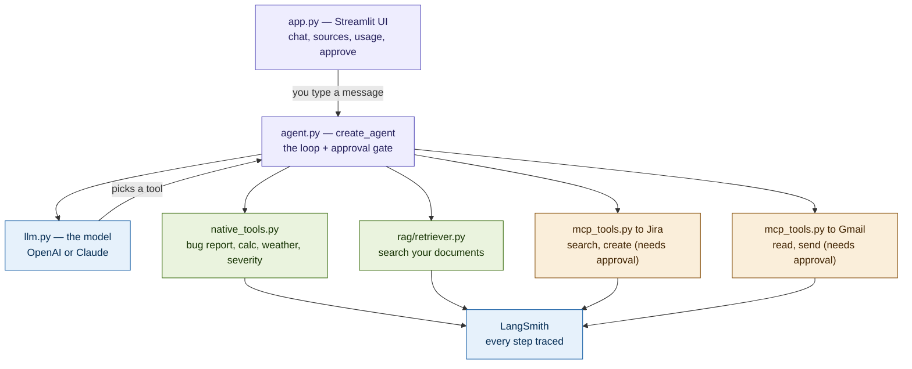

# AI Testing Mastery — LangChain Agent

An AI **agent** you talk to in a web UI. Ask it in plain English and it decides
which tools to use — searching your documents, doing math, reading and creating
**Jira** tickets, reading and sending **Gmail** — and it pauses for your approval
before doing anything real (like sending an email).

This is the **same app we hand-built with MCP, rebuilt on LangChain** — so you can
see, side by side, how much less code the framework needs.

> New to this? You don't need to have done the MCP session. Just follow **Setup**
> below and you'll have it running in ~15 minutes.

---

## What it can do

- **Answer from your documents** (RAG) — "what known bugs affect the login page?"
- **Use simple tools** — a calculator, a weather lookup, a bug-report formatter, a severity advisor
- **Work with real Jira** — search tickets, and create/update them (with approval)
- **Work with real Gmail** — read your inbox, and send email (with approval)
- **Chain tools together** — "find the login bug in our docs and create a Jira ticket for it"
- **Remember the conversation** — refer to "it" or "that" across turns
- **Swap the AI model** — OpenAI or Claude, from a dropdown
- **Show its work** — a sources panel per answer, a live token/cost meter, and full traces in LangSmith

---

## Architecture



**The flow:** you type a message, the agent asks the model what to do, the model
picks a tool, the agent runs it (pausing for your approval if it changes
something real), feeds the result back, and repeats until it has an answer.
Everything is traced in LangSmith.


## What each file does

| File | What it is |
|---|---|
| **`app.py`** | The web app (Streamlit). Draws the chat, the sidebar (tools, model picker, usage meter, MCP-vs-LangChain table, an LCEL demo), the sources panel under each answer, and the **Approve / Cancel** prompt for real actions. This is the only file that talks to the user. |
| **`agent.py`** | Builds the agent in a few lines with `create_agent(model, tools)`, and adds the **approval gate** with one line of middleware (`HumanInTheLoopMiddleware`). In the MCP app, this logic was ~200 lines we wrote and debugged by hand. |
| **`llm.py`** | Picks the AI model. `init_chat_model("openai:gpt-4o-mini")` — change the string and the whole app runs on Claude instead. This is the "swap providers in one line" feature. |
| **`tools/native_tools.py`** | The tools written the LangChain way — each is a plain function with an `@tool` decorator: `format_bug_report`, `search_docs` (RAG), `severity_advisor`, `calculator`, `get_weather`. Adding a tool = adding a function. |
| **`tools/mcp_tools.py`** | Connects your **live MCP servers** (Jira, Gmail) and turns them into LangChain tools, using `langchain-mcp-adapters`. This is how your old MCP work plugs in unchanged. |
| **`rag/retriever.py`** | The RAG pipeline: load the docs → split into chunks → embed them → store in a vector DB → retrieve the relevant bits. Standard LangChain components. |
| **`chains.py`** | A small **LCEL chain** example (`prompt \| model \| parser`) — the pipe syntax. It's here to contrast with the agent: chains are fixed pipelines, agents decide at runtime. |
| **`config/mcp_servers.json`** | Which MCP servers to launch (Jira + Gmail via `uvx`), reading credentials from your `.env`. |
| **`sample_docs/`** | The example QA documents the RAG tool searches (test plans, known bugs, API cases). Swap these for your own. |
| **`.env.example`** | A template listing every setting. You copy it to `.env` and fill in your keys. |
| **`requirements.txt`** | The Python packages to install. |

---

## Setup

**Quick start** (if you just want it running — details for each step below):
```bash
git clone https://github.com/AITestingMastery/langchain-testing-mastery.git
cd langchain-testing-mastery
python -m venv .venv && source .venv/bin/activate    # Windows: .venv\Scripts\activate
pip install -r requirements.txt
cp .env.example .env                                  # then add your OPENAI_API_KEY
streamlit run app.py
```
That runs the app with the built-in tools. Add Jira/Gmail keys to `.env` for the
live integrations (see below).

---


### 1. Install the prerequisites
- **Python 3.10+** — check: `python --version`
- **Node.js 18+** and **uv** — needed to run the Jira/Gmail MCP servers
  - Install uv (Windows PowerShell): `powershell -c "irm https://astral.sh/uv/install.ps1 | iex"`
  - Install uv (Mac/Linux): `curl -LsSf https://astral.sh/uv/install.sh | sh`
- An **OpenAI API key**

### 2. Get the code
```bash
git clone https://github.com/AITestingMastery/langchain-testing-mastery.git
cd langchain-testing-mastery
```

### 3. Install the app
```bash
python -m venv .venv
# Windows:  .venv\Scripts\activate
# Mac/Linux: source .venv/bin/activate

pip install -r requirements.txt
```

### 4. Create your `.env`
```bash
cp .env.example .env        # Windows: copy .env.example .env
```
Open `.env` and fill in what you need:

| Setting | Required? | What it's for | Where to get it |
|---|---|---|---|
| `OPENAI_API_KEY` | **Yes** | the agent + RAG embeddings | platform.openai.com |
| `JIRA_URL` | for Jira | your site, `https://YOURNAME.atlassian.net` | your Jira |
| `JIRA_USERNAME` | for Jira | the email you log in with | — |
| `JIRA_API_TOKEN` | for Jira | an API token | id.atlassian.com → API tokens |
| `GMAIL_CREDENTIALS_PATH` | for Gmail | `./gmail_credentials.json` | Google Cloud (below) |
| `ANTHROPIC_API_KEY` | optional | to swap to Claude | console.anthropic.com |
| `LANGSMITH_API_KEY` | optional | tracing | smith.langchain.com |

> With just `OPENAI_API_KEY`, the app runs fully on the native tools. Jira and
> Gmail are optional add-ons.

### 5. (Optional) Set up Gmail
The Gmail tools need a one-time Google sign-in:
1. In Google Cloud Console, make an OAuth **Desktop app** client, download the JSON, and save it in this folder as `gmail_credentials.json`.
2. Authorize once:
   ```bash
   # Windows: copy gmail_credentials.json credentials.json
   uvx --with "mcp<2" --from mcp-google-gmail mcp-google-gmail auth
   ```
   Sign in, approve. A `token.json` is saved.

### 6. Run it
```bash
streamlit run app.py
```
A browser tab opens. On first launch it connects Jira + Gmail (a short spinner),
then you're ready.

---

## How to use it

Type naturally. Some things to try:

**Simple tools (instant):**
- *What's 15% of 240?*
- *What severity is a database outage?*
- *Format this as a bug report: login button does nothing on Chrome, severity high*

**Your documents (RAG):**
- *What known bugs affect the login page?*
- *What's our session timeout policy?*

**Jira (reading is instant; creating asks for approval):**
- *Search my Jira for open bugs*
- *Create a Jira ticket in TEST: summary "Login bug", type Bug, description "..."* → **Approve**

**Gmail (reading is instant; sending asks for approval):**
- *Do I have any unread emails?*
- *Email a summary of open bugs to you@example.com* → **Approve**

**Chain several tools in one request:**
- *Find the Chrome login bug in our docs, format it, and create a Jira ticket for it*

**Memory (it remembers):**
- *Search my Jira for the login bug* … then … *Create a ticket for the first one*

**Swap the model:** use the sidebar dropdown (OpenAI ↔ Claude).

> **Tip:** be specific and the agent calls the tool right away
> ("create a ticket in TEST, type Bug, summary X"). Be vague and it will ask you
> for details first — that's normal.

---

## The approval gate

Any action that changes something — **send, create, update, delete** — pauses and
shows you exactly what it's about to do, with **Approve** and **Cancel** buttons.
Nothing real happens without your click. Reading (search, list, get) runs freely.

In LangSmith you'll see **two traces** for an approved action: one where the agent
pauses at the gate, one where it resumes after you approve. That's the human step,
made visible.

---

## Observability (LangSmith)

Add `LANGSMITH_API_KEY` and `LANGSMITH_TRACING=true` to `.env`. Every run is traced
automatically — steps, tokens, latency, tool inputs and outputs.

The traces show a **LangGraph** graph, because `create_agent` runs on LangGraph
under the hood — a live reminder that LangChain agents *are* LangGraph graphs.

---

## Why this is "easier" than the hand-built MCP version

| | MCP app (by hand) | This app (LangChain) |
|---|---|---|
| The agent loop | ~200 lines we wrote | `create_agent(model, tools)` |
| The approval gate | hand-built, debugged over sessions | one middleware line |
| Adding a tool | a whole server file | one `@tool` function |
| Swapping the model | rewrite the client | one dropdown |
| Streaming / memory | manual | built in |
| Observability | a panel we hand-built | LangSmith, automatic |
| Old MCP servers | — | plug in as tools |

See **COMPARISON.md** for the full write-up.

---

## Make it your own

- **Add a tool:** write a function in `tools/native_tools.py`, decorate it with `@tool`, add it to `NATIVE_TOOLS`.
- **Change the knowledge base:** drop your files into `sample_docs/`, delete the `chroma_db/` folder so it re-indexes.
- **Add another live service:** add an entry to `config/mcp_servers.json`.
- **Change models:** edit the `PROVIDERS` list in `llm.py`.

---

## Never commit these

`.env`, `gmail_credentials.json`, `credentials.json`, `token.json`, `chroma_db/` —
they hold secrets or are regenerated. They're already in `.gitignore`.